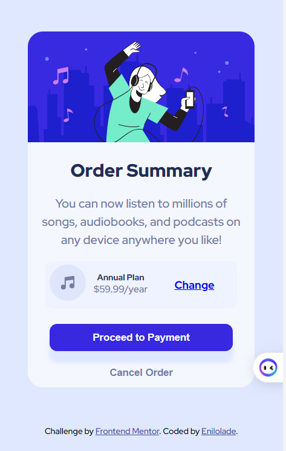
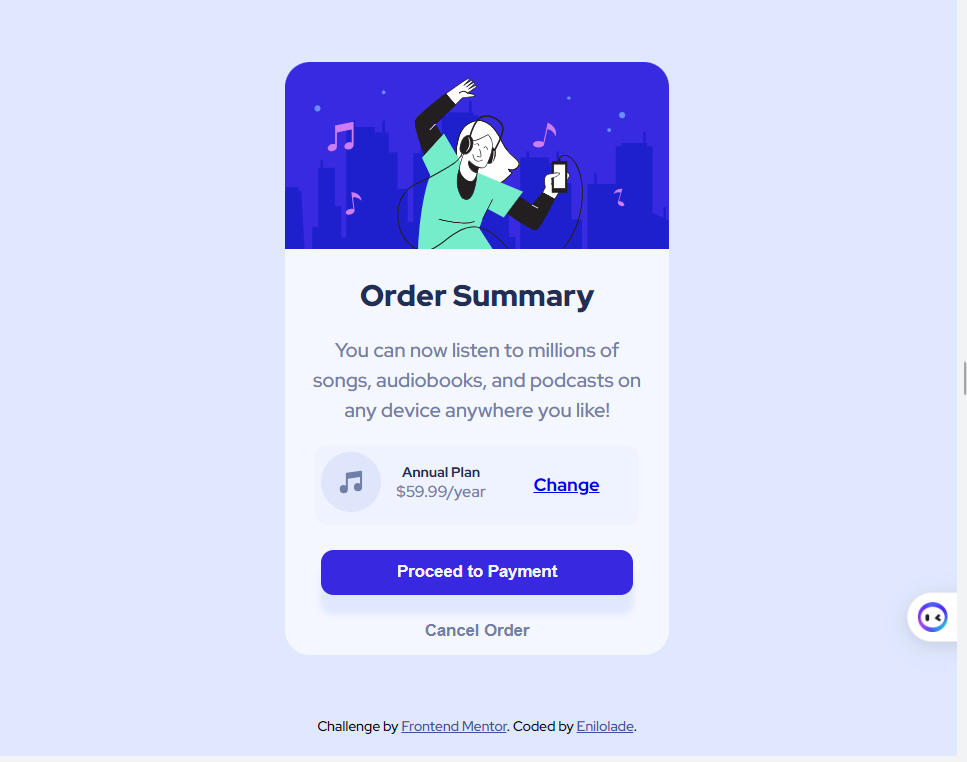

# Frontend Mentor - Order summary card solution

This is a solution to the [Order summary card challenge on Frontend Mentor](https://www.frontendmentor.io/challenges/order-summary-component-QlPmajDUj). Frontend Mentor challenges help you improve your coding skills by building realistic projects. 

## Table of contents

- [Overview](#overview)
  - [The challenge](#the-challenge)
  - [Screenshot](#screenshot)
  - [Links](#links)
- [My process](#my-process)
  - [Built with](#built-with)
  - [What I learned](#what-i-learned)
  - [Useful resources](#useful-resources)
- [Author](#author)

**Note: Delete this note and update the table of contents based on what sections you keep.**

## Overview

- It was my first time doing mobile first approach and to be honest, it wasn't bad, I'll use this first from now on, I didn't stuggle with responsiveness as I usually would.
- I used HTML and CSS to complete the challenge
    -Used div to separate components to allow for easier styling. 
    - I also tried writing down all my steps after looking at the expected outcome before beginning, made things easier
    - Used CSS Grid and Flexbox for the pricing and plan, this allowed me to achieve my layout up to 80%, still struggling but I'm proud of it.
    - Learnt to use box-shadow, it was my first time.
    I'm proud of this challenge overall.


### The challenge

  - I struggled with achieving some of the desired font-sizes and element placement. I'm not a fan of bootstrap but I'll probabbly have to learn it to make responsiveness easier.

### Screenshot!
[Desktop Image](./images/Desktop-design-result.png)




**Note: Delete this note and the paragraphs above when you add your screenshot. If you prefer not to add a screenshot, feel free to remove this entire section.**

### Links

- Solution URL: [Add solution URL here]((https://github.com/Enilolade/order-summary))
- Live Site URL: [Add live site URL here](https://your-live-site-url.com)

## My process

### Built with


- CSS custom properties
- Flexbox
- CSS Grid
- Mobile-first workflow

### What I learned


```css
Learnt to use box-shadow
.proceed{
   
    box-shadow: 0 15px 5px 1px hsl(225, 100%, 94%);
    
}
Also improved my knowledge of media queries
@media (min-width: 680px) and (max-width:990px) {
    .container {
        width: 40%;
    }
}
@media (min-width: 1000px){
    .container {
        width: 30%;
    }
    .order-summary p {
        font-size: 1rem;
    }
    .button > * {
        font-size: 1.1rem;
    }
}
@media (min-width: 1400px){
    .order-summary p {
        font-size: 1.2rem;
    }
    .button > * {
        font-size: 1.3rem;
    }
}


### Useful resources

- [Example resource 1](https://www.w3schools.com/cssref/css3_pr_box-shadow.php) - This helped me with using box-shadow property  reason. 


## Author

- Website - [Add your name Eniola]
- Frontend Mentor - [@Enilolade](https://www.frontendmentor.io/profile/enilolade)


